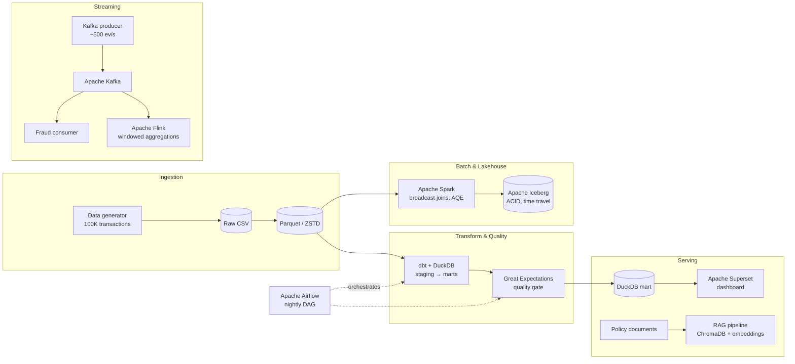

# DataShop Data Platform

**English** · [Русский](README.ru.md)

[](https://github.com/mitiamilovanov/datashop-platform/actions/workflows/ci.yml)

An end-to-end, 7-layer data engineering platform built from scratch for **DataShop**, a fictional e-commerce company — covering the full lifecycle of data: batch processing, a lakehouse, SQL transformations, real-time streaming, orchestration, data quality gates, self-service analytics, and an AI-powered semantic search layer.

Built as a hands-on 12-lab project. Everything runs locally (WSL2 Ubuntu) on a 100K-transaction synthetic dataset, using the same open-source stack and architecture patterns that power production platforms at scale.

## Architecture



## Highlights

- **91% storage reduction and ~14x faster reads** after migrating CSV → Parquet (ZSTD), benchmarked on 5M rows
- **1.67x Spark speedup** on a join pipeline via broadcast joins + Adaptive Query Execution, verified in the Spark UI
- **ACID lakehouse** on Apache Iceberg: 4 append snapshots, time travel queries, zero-downtime schema evolution
- **Real-time fraud detection** on a Kafka stream (~500 events/s), including consumer-group rebalancing and failover
- **Stateful stream processing** with Flink: tumbling and sliding event-time windows with watermarks
- **Nightly pipeline** orchestrated by Airflow: 5 tasks, retries, XCom, quality gate before serving
- **Data quality as a gate**: an 8-expectation Great Expectations suite that caught 4/4 injected data errors
- **Self-service analytics**: a Superset dashboard on a pre-aggregated DuckDB mart (revenue verified to the cent against raw data)
- **Grounded AI search**: a RAG pipeline (SentenceTransformers + ChromaDB) that answers policy questions with citations and safely refuses out-of-scope questions

## The dashboard

The serving layer: an Apache Superset dashboard reading a pre-aggregated DuckDB mart (`agg_daily_revenue`, 9,124 rows at day × category × country grain), built by dbt and gated by Great Expectations upstream.


Revenue splits are near-uniform across countries (France 9.36M → Germany 8.97M, a ~4% spread), while Electronics dominates by category — figures verified to the cent against the raw Parquet source.

## The 12 Labs

| # | Lab | Stack | What was built |
|---|-----|-------|----------------|
| 01 | Environment & data generation | Python, Faker | Synthetic DataShop dataset: 100K transactions, 5K customers, 100 products |
| 02 | Storage formats benchmark | pandas, pyarrow | CSV vs Parquet vs ORC on 5M rows → Parquet/ZSTD chosen platform-wide |
| 03 | Distributed processing | PySpark | Filter/groupBy/agg revenue analysis → category × country summary |
| 04 | Spark performance tuning | PySpark, Spark UI | SortMergeJoin → BroadcastHashJoin + AQE, partitioned writes by date |
| 05 | Lakehouse | Apache Iceberg | ACID table with snapshots, time travel, `ALTER TABLE ADD COLUMN` |
| 06 | SQL transformations | dbt, DuckDB | 3-layer project (sources → staging → marts), 7 tests, lineage docs |
| 07 | Streaming | Apache Kafka (KRaft), Docker | Producer replaying transactions + fraud-detection consumer group |
| 08 | Stateful stream processing | Apache Flink (PyFlink) | Tumbling & sliding window fraud aggregations with event-time watermarks |
| 09 | Orchestration | Apache Airflow | Nightly 5-task DAG: load → clean → aggregate → validate → notify |
| 10 | Data quality | Great Expectations | 8-expectation suite; 4 injected errors caught; pipeline gating pattern |
| 11 | Analytics serving | Apache Superset | 3-chart dashboard over a dedicated read-only DuckDB mart |
| 12 | AI / RAG | ChromaDB, SentenceTransformers | Semantic policy search: chunking, embeddings, grounded prompting |

## Repository layout

```
lab-01/ … lab-12/   # per-lab scripts (each lab is self-contained)
data/               # generated datasets (gitignored — reproducible from lab-01/lab-02 scripts)
```

Notable entry points:

- `lab-02/benchmark.py` — storage format benchmark
- `lab-04/optimized_pipeline.py` — tuned Spark join pipeline
- `lab-05/time_travel.py` — Iceberg snapshot queries
- `lab-06/ecommerce_project/` — full dbt project (models, tests, sources)
- `lab-07/docker-compose.yml` + `producer.py` / `consumer.py` — Kafka streaming
- `lab-08/fraud_windows.py` — Flink Table API windowed aggregation
- `lab-09/datashop_nightly_pipeline.py` — Airflow DAG
- `lab-10/gx_suite.py` / `gx_validate.py` — quality suite and validation runs
- `lab-12/ingest.py` / `query.py` — RAG ingestion and semantic query

## Environments

Each subsystem runs in its own isolated conda environment to avoid dependency conflicts:

| Environment | Used for |
|-------------|----------|
| `bde_env` | Core: Spark, Iceberg, dbt, DuckDB, Kafka clients (labs 01–07) |
| `flink-env` | PyFlink 1.19 (lab 08) |
| `airflow-env` | Airflow 2.9 (lab 09) |
| `gx-env` | Great Expectations 1.2 (lab 10) |
| `superset-env` | Apache Superset (lab 11) |
| `rag-env` | ChromaDB + SentenceTransformers (lab 12) |

## Reproducing

```bash
# 1. Generate the dataset
conda activate bde_env
python lab-01/generate_datashop_data.py

# 2. Convert to Parquet (downstream labs read from data/parquet/)
python lab-02/convert_datashop.py

# 3. Run any lab — each is independent, see the table above.
#    Kafka labs need Docker: docker compose -f lab-07/docker-compose.yml up -d
```
---

**Author:** Mitia Milovanov · built with [Claude Code](https://claude.com/claude-code) as a pair-programming tutor
