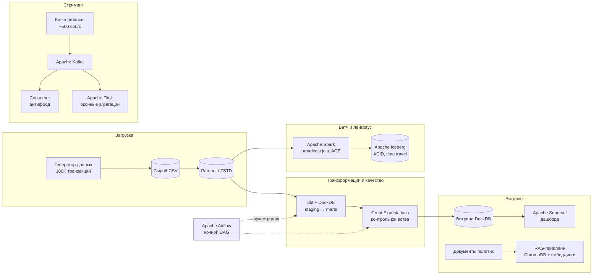
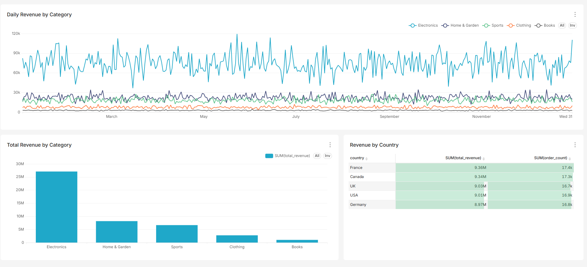

# DataShop Data Platform

[English](README.md) · **Русский**

[](https://github.com/mitiamilovanov/datashop-platform/actions/workflows/ci.yml)

Дата-платформа из семи слоёв, построенная с нуля для **DataShop** — вымышленного интернет-магазина. Покрывает полный жизненный цикл данных: пакетную обработку, лейкхаус, SQL-трансформации, потоковую обработку в реальном времени, оркестрацию, контроль качества данных, self-service аналитику и слой семантического поиска на базе AI.

Проект собран в ходе 12 практических лабораторных работ. Всё работает локально (WSL2 Ubuntu) на синтетическом датасете из 100 000 транзакций — на том же open-source стеке и тех же архитектурных паттернах, что используются в промышленных платформах.

## Архитектура



## Ключевые результаты

- **Объём хранения сократился на 91%, чтение ускорилось в ~14 раз** после перехода CSV → Parquet (ZSTD); замерено на 5 млн строк
- **Ускорение Spark-пайплайна в 1.67 раза** за счёт broadcast join и Adaptive Query Execution; подтверждено планами выполнения в Spark UI
- **ACID-лейкхаус на Apache Iceberg**: 4 снапшота, запросы к историческим версиям (time travel), эволюция схемы без простоя
- **Антифрод в реальном времени** на потоке Kafka (~500 событий/с), включая ребалансировку consumer group и отработку отказа
- **Stateful-обработка потока во Flink**: тумблинговые и скользящие окна по event time с watermarks
- **Ночной пайплайн в Airflow**: 5 задач, ретраи, XCom, проверка качества перед публикацией витрины
- **Качество данных как барьер**: набор из 8 ожиданий Great Expectations поймал 4 из 4 намеренно внесённых ошибок
- **Self-service аналитика**: дашборд Superset поверх предагрегированной витрины DuckDB (выручка сверена с сырыми данными до цента)
- **AI-поиск с опорой на источники**: RAG-пайплайн (SentenceTransformers + ChromaDB) отвечает на вопросы по политикам со ссылками на документы и корректно отказывается отвечать вне своей базы знаний

## Дашборд

Слой витрин: дашборд Apache Superset читает предагрегированную витрину DuckDB (`agg_daily_revenue`, 9 124 строки в разрезе день × категория × страна), которая собирается через dbt и проходит проверку качества Great Expectations выше по потоку.



Выручка распределена по странам почти равномерно (от 9.36 млн во Франции до 8.97 млн в Германии — разброс около 4%), а среди категорий с большим отрывом лидирует электроника. Все цифры сверены до цента с исходными Parquet-файлами.

## 12 лабораторных работ

| № | Тема | Стек | Что построено |
|---|------|------|---------------|
| 01 | Окружение и генерация данных | Python, Faker | Синтетический датасет: 100K транзакций, 5K клиентов, 100 товаров |
| 02 | Бенчмарк форматов хранения | pandas, pyarrow | CSV против Parquet и ORC на 5 млн строк → Parquet/ZSTD выбран для всей платформы |
| 03 | Распределённая обработка | PySpark | Фильтрация, группировка и агрегация выручки → сводка категория × страна |
| 04 | Оптимизация Spark | PySpark, Spark UI | SortMergeJoin → BroadcastHashJoin и AQE, запись с партиционированием по дате |
| 05 | Лейкхаус | Apache Iceberg | ACID-таблица со снапшотами, time travel, `ALTER TABLE ADD COLUMN` |
| 06 | SQL-трансформации | dbt, DuckDB | Трёхслойный проект (sources → staging → marts), 7 тестов, документация с линиджем |
| 07 | Потоковая обработка | Apache Kafka (KRaft), Docker | Producer, воспроизводящий транзакции, и consumer group для антифрода |
| 08 | Stateful-обработка потока | Apache Flink (PyFlink) | Тумблинговые и скользящие окна по event time с watermarks |
| 09 | Оркестрация | Apache Airflow | Ночной DAG из 5 задач: загрузка → очистка → агрегация → валидация → уведомление |
| 10 | Качество данных | Great Expectations | Набор из 8 ожиданий; пойманы 4 внесённые ошибки; паттерн блокировки пайплайна |
| 11 | Аналитические витрины | Apache Superset | Дашборд из 3 чартов поверх отдельной read-only витрины DuckDB |
| 12 | AI / RAG | ChromaDB, SentenceTransformers | Семантический поиск по политикам: чанкинг, эмбеддинги, grounded-промптинг |

## Структура репозитория

```
lab-01/ … lab-12/   # скрипты по лабораторным (каждая самодостаточна)
data/               # сгенерированные данные (в .gitignore — воспроизводятся скриптами lab-01/lab-02)
```

Основные точки входа:

- `lab-02/benchmark.py` — бенчмарк форматов хранения
- `lab-04/optimized_pipeline.py` — оптимизированный Spark-пайплайн с join
- `lab-05/time_travel.py` — запросы к снапшотам Iceberg
- `lab-06/ecommerce_project/` — dbt-проект целиком (модели, тесты, источники)
- `lab-07/docker-compose.yml` + `producer.py` / `consumer.py` — стриминг через Kafka
- `lab-08/fraud_windows.py` — оконная агрегация на Flink Table API
- `lab-09/datashop_nightly_pipeline.py` — DAG для Airflow
- `lab-10/gx_suite.py` / `gx_validate.py` — набор проверок и запуски валидации
- `lab-12/ingest.py` / `query.py` — загрузка в векторную БД и семантический поиск

## Окружения

Каждая подсистема живёт в отдельном conda-окружении, чтобы избежать конфликтов зависимостей:

| Окружение | Для чего |
|-----------|----------|
| `bde_env` | Основное: Spark, Iceberg, dbt, DuckDB, клиенты Kafka (лабы 01–07) |
| `flink-env` | PyFlink 1.19 (лаба 08) |
| `airflow-env` | Airflow 2.9 (лаба 09) |
| `gx-env` | Great Expectations 1.2 (лаба 10) |
| `superset-env` | Apache Superset (лаба 11) |
| `rag-env` | ChromaDB + SentenceTransformers (лаба 12) |

## Как воспроизвести

```bash
# 1. Сгенерировать датасет
conda activate bde_env
python lab-01/generate_datashop_data.py

# 2. Конвертировать в Parquet (последующие лабы читают из data/parquet/)
python lab-02/convert_datashop.py

# 3. Запустить любую лабу — каждая независима, см. таблицу выше.
#    Для лаб с Kafka нужен Docker: docker compose -f lab-07/docker-compose.yml up -d
```
---

**Автор:** Митя Милованов · собрано в паре с [Claude Code](https://claude.com/claude-code)
